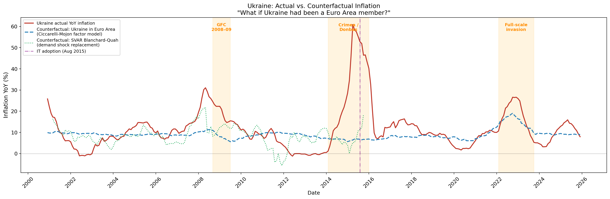

# Counterfactual Inflation Analysis: What If Ukraine Had Been Part of the Euro Area?


> **Research question:** What would Ukraine's inflation trajectory have looked like
> had it been a member of the Euro Area — and what does this imply about the cost
> or benefit of monetary sovereignty during the 2008–2009, 2014–2015, and 2022 crises?

_QMF Final Exam 2025–2026 — Master 2 FTD, Université Paris 1 Panthéon-Sorbonne_  
_Instructor: Eric Vansteenberghe (Banque de France)_

---

## Overview

This project constructs a counterfactual inflation path for Ukraine under the
hypothesis of Euro Area membership, using two independent structural identification
strategies:

| Method                         | Identification                                                                              | Data                                            |
| ------------------------------ | ------------------------------------------------------------------------------------------- | ----------------------------------------------- |
| **Ciccarelli-Mojon (2010)**    | Common factor extraction (PCA) + loading calibration on quiet periods                       | ECB HICP panel (11 countries, 2000–2025)        |
| **Blanchard-Quah (1989) SVAR** | Long-run demand/supply shock decomposition; demand shocks replaced by Euro Area equivalents | World Bank GDP, EA Industrial Production (FRED) |

The counterfactual is **not** a mechanical average of Euro Area inflation — it embeds
Ukraine's structural inflation differential (α = 6.39) and sensitivity to the
common European factor (λ = 1.178, p = 0.040), consistent with the
Balassa-Samuelson catch-up dynamic and the Barro-Gordon credibility-import channel.

Part A of the exam provides the identification foundation: a documented chronology
of the NBU's exchange rate regimes (2000–2025), showing that the Euro Area membership
"treatment" is time-varying — large during devaluation episodes and the IT period
(2015–2022), small during dollar-peg plateaux (2000–2008, 2009–2014, 2022–2023).

---

## Key Results

### Counterfactual gaps by crisis episode

| Episode                  | Ukraine actual (mean) | CF — Ciccarelli-Mojon | CF — SVAR BQ         | Gap (CM)    |
| ------------------------ | --------------------- | --------------------- | -------------------- | ----------- |
| GFC 2008–09              | 19.9%                 | 8.2%                  | 11.6%                | **+11.7pp** |
| Crimea / Donbas 2014–15  | 31.6%                 | 6.7%                  | 7.2%                 | **+24.9pp** |
| Full-scale invasion 2022 | 18.8%                 | 15.3%                 | — _(data truncated)_ | **+3.5pp**  |

**Sanity check (Barro-Gordon):** pre-2016 gap (+3.54pp) > post-2016 gap (+1.91pp) ✓  
→ Credibility-import benefit front-loaded, consistent with NBU's partial IT convergence post-2015.

### Figure



_Ukraine actual YoY inflation vs. two counterfactual paths. Shaded areas: GFC (2008–09),
Crimea/Donbas (2014–15), full-scale invasion (2022). Dashed vertical line: IT adoption (Aug 2015)._

---

## Interpretation

The counterfactual, estimated via two independent methods — Ciccarelli-Mojon (2010)
factor loading and Blanchard-Quah (1989) SVAR demand-shock replacement — consistently
shows that Euro Area membership would have substantially lowered Ukrainian inflation during
crisis episodes. During the GFC (2008–09), the actual–counterfactual gap averaged +11.7pp
(CM) and +8.3pp (SVAR), reflecting the inflationary cost of the UAH's 49% depreciation,
an adjustment channel unavailable under euro membership. The gap is largest during the
Crimea/Donbas episode (2014–15), averaging +24.9pp (CM) and +23.2pp (SVAR) against a
counterfactual of ~7%, as the cumulative 73% hryvnia collapse passed through entirely to
consumer prices — a channel the ECB's nominal anchor would have eliminated. Conversely,
during the 2022 full-scale invasion, the gap narrows to +3.5pp (CM only, SVAR truncated
by data availability), because the Euro Area itself was absorbing a large energy-price
shock, limiting the insulation that ECB membership would have provided. Consistent with
Barro and Gordon (1983) and Giavazzi and Pagano (1988), the credibility-import benefit
is front-loaded: the pre-2016 gap (+3.54pp average) exceeds the post-2016 gap (+1.91pp),
as the NBU's adoption of inflation targeting in August 2015 partially converged Ukraine's
monetary framework toward the ECB norm. Finally, following De Grauwe (2012), Euro Area
membership would not have been an unambiguous gain: in 2014 and 2022, Ukraine avoided
currency crises precisely because it could devalue and impose capital controls —
instruments unavailable under the euro, which might instead have triggered sovereign
debt distress without a national lender of last resort.

---

## Project Structure

## Structure du Projet

QMF_FINAL_PROJECT/
├── data/ # Source datasets (repository-provided CSVs)
│ ├── data_ecb_hicp_panel.csv # HICP YoY inflation, 11 EA countries, Jan 2000–Dec 2025 (ECB Data Portal)
│ └── data_ukraine_cpi_raw.csv # Ukraine CPI MoM index (base = previous month), SSSU via SDMX
├── output/ # Generated outputs — auto-created at runtime
│ ├── output_counterfactual_data.csv # Full time series: actual + 2 counterfactuals + EA factor
│ ├── output_counterfactual_ukraine.png # Main figure — Part B deliverable 1
│ └── output_ea_factor.png # Diagnostic: EA common factor (PC1) vs. simple mean
├── .gitignore # Excludes .venv, **pycache**, .DS_Store
├── .python-version # Python version pin for uv (3.12)
├── INTERPRETATION.md # Interpretation paragraph — Part B deliverable 2
├── Part_A.pdf # Part A: NBU exchange rate regime chronology (2000–2025)
├── part_B.py # Main script: data loading → factor model → SVAR → figure
├── pyproject.toml # Project metadata and dependencies
├── README.md # This file
└── uv.lock # Exact dependency versions locked by uv

---

## Data Sources

| Dataset                              | Source                                              | Access                      |
| ------------------------------------ | --------------------------------------------------- | --------------------------- |
| ECB HICP panel (11 EA countries)     | ECB Data Portal                                     | Provided in `data/`         |
| Ukraine CPI MoM index                | State Statistics Service of Ukraine (SSSU) via SDMX | Provided in `data/`         |
| Real GDP growth (Ukraine, Euro Area) | World Bank Open Data (`NY.GDP.MKTP.KD.ZG`)          | Downloaded programmatically |
| EA Industrial Production             | FRED (`EA19PRINTO01IXOBM`)                          | Downloaded programmatically |

All external data is downloaded programmatically at runtime — no manual
intervention required. Fallback Chow-Lin interpolation from annual World Bank
GDP is used when monthly IP series are unavailable.

---

## Installation & Reproduction

Requires **Python >= 3.12**.

```bash
git clone https://github.com/<your-username>/qmf_final_project.git
cd qmf_final_project
```

**With [uv](https://docs.astral.sh/uv/) (recommended):**

```bash
uv sync
uv run part_B.py
```

**With pip:**

```bash
python -m venv .venv && source .venv/bin/activate
pip install -r requirements.txt
python part_B.py
```

The script will:

1. Load and harmonise the two repository datasets
2. Extract the EA common inflation factor (Ciccarelli-Mojon)
3. Calibrate the loading λ on quiet periods (full sample, excluding crises)
4. Estimate the Blanchard-Quah SVAR with long-run identification
5. Produce the counterfactual figure and CSV
6. Print the episode statistics and interpretation

Expected runtime: ~30 seconds (network-dependent for external data download).

---

## Methodology

### Part A — NBU Regime Chronology

Five distinct monetary regimes identified over 2000–2025, following IMF AREAER
de facto classifications (Calvo and Reinhart, 2002):

| Period            | UAH/USD          | De facto regime                    | Monetary sovereignty              |
| ----------------- | ---------------- | ---------------------------------- | --------------------------------- |
| 2000–Aug 2008     | ≈ 5.0 (fixed)    | Conventional peg to USD            | None (impossible trinity binding) |
| Sep 2008–Mar 2009 | 5.3 → 7.9 (+49%) | Managed float / forced devaluation | Constrained (IMF SBA)             |
| Apr 2009–Jan 2014 | ≈ 8.0 (fixed)    | Stabilised arrangement             | None                              |
| Feb 2014–Jul 2015 | 8 → 30 (+275%)   | Managed float / dual devaluation   | Constrained (capital controls)    |
| Aug 2015–Jan 2022 | 22–28 (gradual)  | Managed float + IT                 | **Genuine** (IT adopted Aug 2015) |
| Feb 2022–Sep 2023 | 29.25 → 36.57    | Wartime fixed peg                  | None (martial law)                |
| Oct 2023–2025     | 37–44 (managed)  | Managed float / flexible IT        | **Partial** (IMF conditionality)  |

### Part B — Identification Strategy

**Method 1 (Ciccarelli-Mojon):** The EA common factor is extracted as the first
principal component of the standardised HICP panel (PC1 = 80.8% of variance),
rescaled to inflation units via affine projection (R² = 0.999). Ukraine's loading λ
is calibrated on the full sample excluding crisis/devaluation episodes (186 obs),
following Ciccarelli and Mojon (2010)'s use of the full available sample for structural
identification. The counterfactual CF = α + λ·F_EA is floored at the EA mean
(Balassa-Samuelson constraint).

**Method 2 (Blanchard-Quah SVAR):** Bivariate SVAR (output growth, inflation) estimated
separately for Ukraine and the Euro Area. Long-run identification (Blanchard and Quah,
1989): supply shocks have permanent effects on output, demand shocks do not. The
counterfactual replaces Ukraine's demand shocks with Euro Area demand shocks, feeding
them through Ukraine's estimated impulse response functions — operationalising
Bayoumi and Eichengreen (1993)'s OCA shock decomposition. Lag order selected by AIC.
Stationarity verified by ADF tests; first-difference transformation applied where required.

---

## References

- Barro, R.J. and Gordon, D.B. (1983). Rules, discretion and reputation in a model of monetary policy. _Journal of Monetary Economics_, 12(1), 101–121.
- Bayoumi, T. and Eichengreen, B. (1993). Shocking aspects of European monetary integration. In _Adjustment and Growth in the European Monetary Union_. Cambridge University Press.
- Blanchard, O.J. and Quah, D. (1989). The dynamic effects of aggregate demand and supply disturbances. _American Economic Review_, 79(4), 655–673.
- Calvo, G.A. and Reinhart, C.M. (2002). Fear of floating. _The Quarterly Journal of Economics_, 117(2), 379–408.
- Ciccarelli, M. and Mojon, B. (2010). Global inflation. _The Review of Economics and Statistics_, 92(3), 524–535.
- De Grauwe, P. (2012). The governance of a fragile eurozone. _Australian Economic Review_, 45(3), 255–268.
- Giavazzi, F. and Pagano, M. (1988). The advantage of tying one's hands: EMS discipline and central bank credibility. _European Economic Review_, 32(5), 1055–1075.
- IMF (2009). Ukraine: Request for Stand-By Arrangement. Country Report No. 09/42.
- IMF (2014). Ukraine: Request for Stand-By Arrangement. Country Report No. 14/106.
- NBU (2015). Monetary Policy Strategy 2016–2020 (Board Resolution No. 541).
